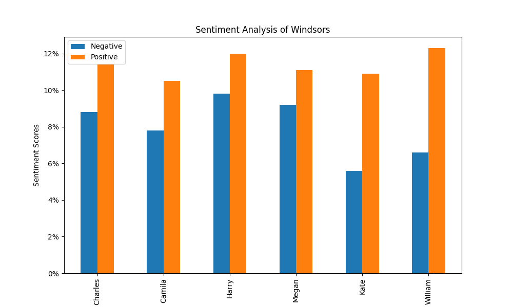

# Method
- Sample collected from various News article on DailyMail.
- Targeting Comments are reply to articles about Windsors following coronation

## Questions
### How popular is each prominent member of the windsors?

Using sentiment analysis and Part of speech tagging below is a representation of the Positive and Negative sentiment associated with each family member.

